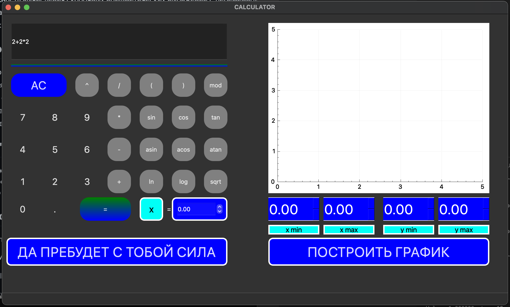
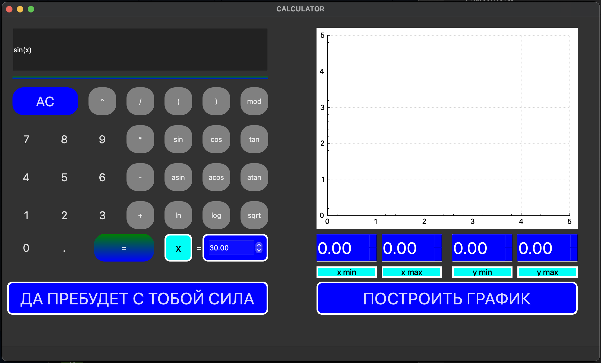

# Проект "SmartCalc" 

## Описание проекта
Проект "SmartCalc" - это программа для вычисления математических выражений и построения графиков функций. 🧮 Проект был разработан на языке C и С++. Он предоставляет возможность вычислять арифметические выражения, включая скобочные выражения, а также строить графики функций с заданными областями определения и значений. 📈

## Особенности проекта
- Программа поддерживает как целые, так и вещественные числа. 🌟
- Поддержка ввода чисел в экспоненциальной записи. 🚀
- Возможность вычисления скобочных арифметических выражений с переменной x. 🔢
- Реализация графического интерфейса с использованием GUI-библиотеки, такой как Qt. 🖥️
- Возможность управления отображаемой областью определения и областью значений на графике. 🌐

## Технологии и инструменты
- Язык программирования: C и С++. 💻
- Компилятор: GCC. 🛠️
- Сборка с использованием Makefile. 🏗️
- Использование библиотеки Check для модульного тестирования. ✅
- Графический интерфейс, созданный с использованием  Qt. 📲

## Как использовать
1. Соберите проект с помощью Makefile.
2. **install**: Устанавливает калькулятор в папку сборки и на рабочий стол. 📂
3. **uninstall**: Удаляет калькулятор. ❌
4. **dvi**: Открывает документацию проекта. 📖
5. **dist**: Генерирует дистрибутив .tgzс исполняемым файлом и необходимой документацией. 📦
6. **test**: Начать тестирование модулей калькулятора и его контроллера. Отчет можно посмотреть в /tests/logs папке. ✅
7. **gcov_report**: Формирует html-отчет, отображающий покрытие всех функций тестами. 📊

7. Запустите программу и введите математическое выражение или выберите режим "кредитного калькулятора".
8. Нажмите "=" для выполнения вычислений. 🔄

## Примеры использования

  
📌 Пример 1: Главное меню

  
  
На главном экране вы можете ввести математическое выражение и нажать "=", чтобы выполнить вычисления.

  
📌 Пример 2: Вычисление

  
  
Решение предыдущего примера

  
📌 Пример 3: Вычисление функции

  
  
Таким образом можно подсчитать выражение💰

  
📌 Пример 4: Ответ выражения

  
  
Ответ выражения

  
📌 Пример 5: График

  
  
Таким образом вырисовывается график (bruh)

  
📌 Пример 6: Обработка ошибок

  
  
Здесь пример ошибочного выражения

  
📌 Пример 5: Вывод ошибок

  
  
Так выводится ошибка

